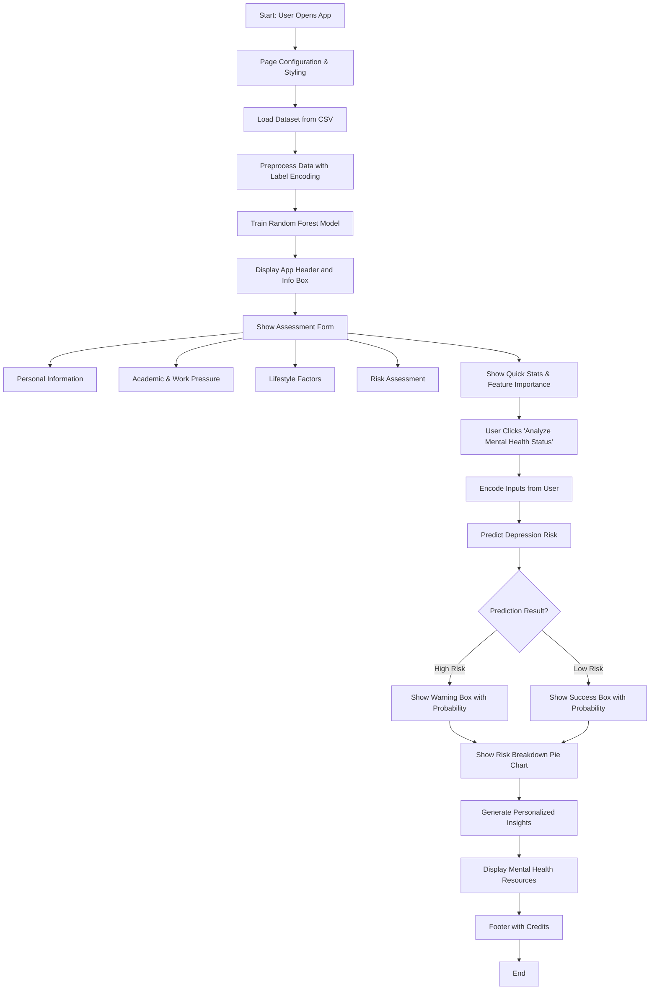

# Mental_Health_Detector_Webapp
# 🧠 Mental Health Detector

Screen your mental well-being using AI. This app predicts the likelihood of **depression** based on lifestyle, academic, and personal indicators using machine learning.

---

## Features

* 🧠 AI-powered mental health assessment form
* 📊 Depression likelihood score with explanation
* 🎯 Top 5 contributing risk factors visualized
* 📝 Personalized recommendations based on input
* 📈 Dataset insights and depression statistics
* 🆘 Mental health resource links and helplines

---

## Installation

Follow these steps to get the Mental Health Detector up and running on your local machine:

1. **Clone the repository:**

    ```bash
    git clone https://github.com/RajdeepSutradhar5105/Mental_Health_Detector_Webapp.git
    cd Mental_Health_Detector
    ```

2. **Install the required dependencies:**

    ```bash
    pip install -r requirements.txt
    ```

    > Includes: `streamlit`, `scikit-learn`, `pandas`, `numpy`, `matplotlib`, `plotly`

---

## How to Run

1. **Start the Streamlit application:**

    ```bash
    streamlit run app.py
    ```

2. **Open in your browser:**

    The app will open automatically at `http://localhost:8501`.

---

## Usage

1. Navigate through form sections:
   - 👤 Personal Information
   - 📚 Academic & Work Pressure
   - 🏃‍♂️ Lifestyle Habits
   - ⚠️ Risk Assessment

2. Fill in the assessment form honestly.

3. Click **"🧠 Analyze Mental Health Status"** to view:
   - Depression likelihood score
   - Pie chart of results
   - Key insights and recommendations

4. Scroll down for educational resources and emergency contact info.

---
 ## Video Presentation Of Project

https://github.com/user-attachments/assets/b7e67fe6-2906-402d-b60c-9924e44b8469

---
## Workflow



